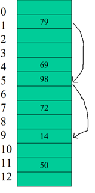
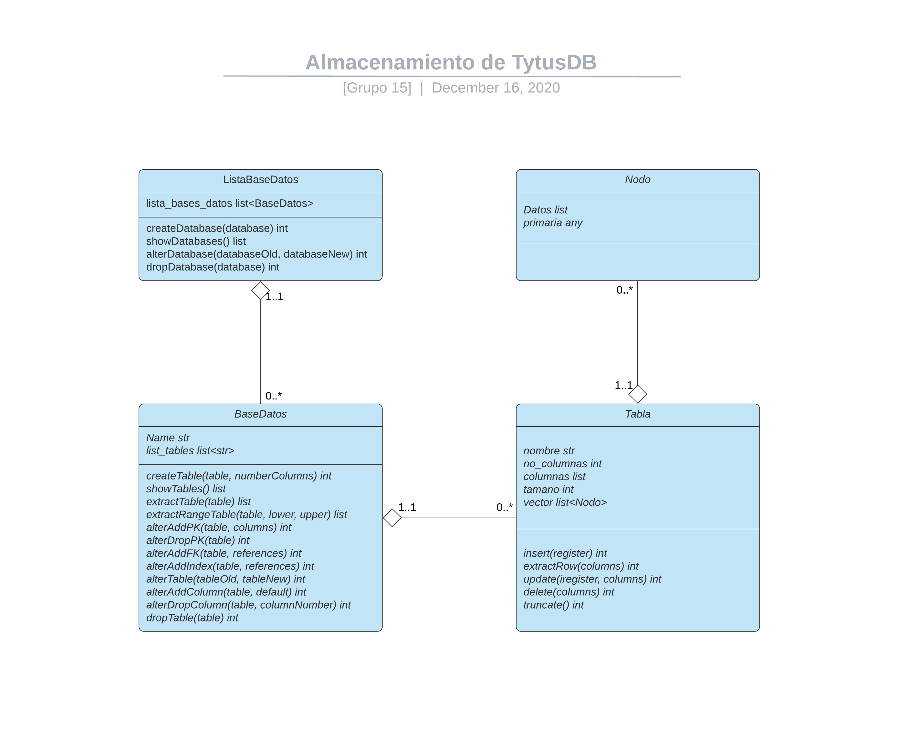

# Manual Técnico

## Indice

- [Introducción](#introducción)
- [Objetivos](#objetivos)
- [Alcances del proyecto](#alcances-del-proyecto)
- [Requerimentos funcionales](#requerimentos-funcionales)
- [Estructura de bases de datos](#estructura-de-bases-de-datos)
- [Estructura de tablas](#estructura-de-tablas)
- [Reportador gráfico](#reportador-grafico)
- [Diagrama de clases](#diagrama-de-clases)
- [Diagrama de Gantt](#diagrama-de-gantt)

## Introducción

cuerpo

## Objetivos

cuerpo

## Alcances del proyecto

Este proyecto esta focalizado a la creación de la estructura interna de un Sistema Manejador de Bases de Datos, o DataBase Management System (DBMS). Se podría calificar como un subproyecto, de un proyecto que se trabaja en conjunto a compañeros de otros dos cursos de la carrera de Ingenieria en Ciencias y Sistemas en la Universidad de San Carlos de Guatemala, siendo la idea primordial, la unificación de los 3 proyectos, para la creación de un DBMS completo y funcional, creado desde cero, y con licencia abierta MIT.

Esta siendo elaborado por estudiantes del curso Estructuras de Datos, por lo cual consiste en una librería que provee funciones para crear, modificar y eliminar bases de datos, tablas y sus registros.  

El modo de almacenamiento que maneja esta librería es por medio de tablas Hash, de ahí el nombre HashMode, la estructura propuesta se utiliza en las tablas, es decir cada tabla se maneja como una Tabla Hash en la cual se almacenan los registros o tuplas, el acceso al almacenamiento es por medio de la llave primaria previamente definida para la tabla en cuestión, o bien, con una llave escondida en caso que no se defina llave primaria.

La finalidad de utilizar las tablas Hash como modo de almacenamiento es para explotar su orden de complejidad, en la búsqueda de los datos, siendo esta en el mejor de los casos un orden constante O(1), puesto que con la función hash se puede obtener directamente el índice en el cual se encuentra almacenado el dato al que queremos acceder. 

Se utiliza una Tabla Hash abierta de direccionamiento cerrado, se eligió esta, sobre la tabla cerrada de direccionamiento abierto, pues se exploro una forma de explotar la característica de enlistar los datos que van al mismo índice (conocidos como colisiones), pues esta lista es manipulable y se pueden explorar algoritmos de búsqueda mas rápidos, situación que se vuelve complicada en las tablas de direccionamiento abierto, pues en ellas no se conoce con exactitud donde pueden ubicarse los datos que colisionan, creando una complejidad lineal O(n) en el acceso a los datos, sin embargo las cuestiones técnicas de la elección de la estructura se abordan en la sección [Estructura de tablas](#estructura-de-tablas).

No todo se maneja con tablas Hash, puesto que se considero que la parte con mas volumen de datos a manejar son las tablas, sin embargo, las bases de datos se manejan como listas sencillas de Python, pues no se esperan cantidades excesivas de tablas en una base de datos, así mismo la lista que almacena las bases de datos es una lista sencilla de Python. 

Como estructura interna de un DBMS, además de la eficiencia y eficacia de las creaciones, inserciones y demás gestiones, otro punto importante es la persistencia de los datos, dicha persistencia se maneja con un sistema hibrido entre un sistema jerárquico de ficheros y la serialización de objetos que guardan la información de cada Tabla Hash, así cada vez que se insertan nuevos registros los cambios se guardan en memoria volviendo a serializar los objetos previamente creados, este proceso de recuperar y serializar los objetos puede ser significativo para la maquina y la eficiencia del proyecto, es por ello que se recurrió a algoritmos que hicieran menos recurrente este proceso y se aprovecharan también los recursos cargados en memoria en cierto instante de la ejecución de la librería, esto hace más eficaz las operaciones aunque exige un poco de persistencia en memoria de cierto objetos, siempre respetando limites para no sobrecargarla de información.


## Requerimentos funcionales

cuerpo

## Estructura de bases de datos

cuerpo

## Estructura de tablas
## Paradigma utilizado
 Se aprovecho el paradigma orientado a objetos para la elaboración de las tablas, siendo cada una de ellas un objeto, que a su vez es una estructura (Tabla Hash), y esta estructura contiene objetos Nodo, los cuales contienen atributos especiales, de llave primaria y la contención de los datos, siendo básicamente cada nodo la tupla o registro de la tabla.
## Estructura utilizada
 La estructura utilizada para el almacenamiento de las tuplas es una tabla Hash abierta de direccionamiento cerrado, con los siguientes atributos:
  -	 Su tamaño inicial es 13
-	Con un máximo de 90% y un mínimo de 30%
-	La función hash implementada, método de división (k mod m)

#### ¿Por qué una tabla hash abierta de direccionamiento cerrado?
Se opto por este tipo de tabla hash para optimizar las búsquedas al momento de las colisiones, pues en una tabla hash cerrada de direccionamiento abierto las colisiones son mas frecuentes e incontrolables, pues estas se manejan aumentando el índice y nunca se puede llevar un control de donde realmente las va a colocar, puede llegar a un punto donde siempre colisione haciendo que los índices se corran y la búsqueda resultar lineal.




Al observar esto, y contemplar la posibilidad de que el orden se vuelva lineal, se concluyo que esto no seria optimo. Por lo cual se exploro las tablas hash abiertas de direccionamiento cerrado, en estas se debe ir formando una lista de los valores que colisionen, asi que se sabra con certeza donde están los valores, sin embargo, el problema persistiría la búsqueda se volvería lineal.

Aquí es donde se hizo la modificación para la optimización de búsquedas, se ordena la lista para implementar una búsqueda binaria interna, asegurando así que el orden no llegaría a ser lineal, si no, *logarítmico*.


El algoritmo es sencillo, en cada inserción se comprueba si la lista esta vacía, si lo esta el dato sencillamente se inserta, si no lo esta el dato se inserta y posteriormente la lista se manda a un método burbuja para ser ordenada.

Se sacrifica tiempo en la inserción, pues esta aplica ordenamientos y mas comprobaciones, pero este tiempo se optimiza al momento de cualquier búsqueda, para eliminar, modificar o sencillamente consultar.
```sh
Nota: Esta optimización solo se logro para llaves primarias enteras, las llaves primarias string causan confusión, en caso de tener llaves string el orden si podría llegar al ser lineal 
```
## Clases y sus atributos
Para el correcto funcionamiento de las tablas se hizo uso de dos clases, Tabla y Nodo, cada tabla en la libreria es una instancia de Tabla y cada registro o tupla es una instancia de la clase Nodo, esto se puede observar de mejor manera en el [diagrama de clases](#diagrama-de-clases)

#### Nodo
Como se menciono anteriormente, una instancia de esta clase representa una tupla o registro de la tabla, para instanciar esta clase se requieren los siguientes argumentos:
- Los datos a registrar
- Una lista con las posiciones de la llave primaria
- Un contador, en caso se maneje llave oculta

Estos argumentos se pasan automaticamente en el metodo *insertar* de la clase Tabla, los datos son los datos que se quieren regsitrar, la lista es el atributo PK de la clase, y el contador es un autoincrementable que maneja la clase.

Este objeto sirve como un contenedor, en este se contienen los datos del registro, y el mismo objeto al instanciarse verifica las pocisiones de la llave primaria (la lista que se le envia) y automaticamente la forma, en caso la Tabla no tenga llave primaria definida, el atributo PK sera *None*, y en dicho caso el objeto toma como llave primaria el contador que recibio.
```sh
Asi es como cada instancia de Nodo es un registro o tupla con su llave primaria definida.
```

#### Tabla
Cada instancia de Tabla, es una tabla en la base de datos, la cual maneja el almacenamiento por medio de una Tabla Hash, para instanciar esta clase se requieren los siguientes argumentos:
- Nombre, el nombre de la tabla, el cual sera unico en determinada Base de Datos
- Columnas, es el numero de columnas que posee la tabla

Con estos parametros se construye el objeto, el cual toma el nombre indicado y se atribuye el numero de columnas igualmente indicado, define su tamaño inicial como 13, la Pk y tipo de Pk, como *None* pues esto debe ser indicado posteriormente por otro metodo, y sus respectivos contadores de datos y factor de carga como 0.

```sh
Una vez instanciado este objeto se puede decir que la base de datos tiene una tabla mas, en la cual se pueden realizar inserciones y demas operaciones.
```

## Reportador grafico

cuerpo

## Diagrama de clases



## Diagrama de Gantt

cuerpo
